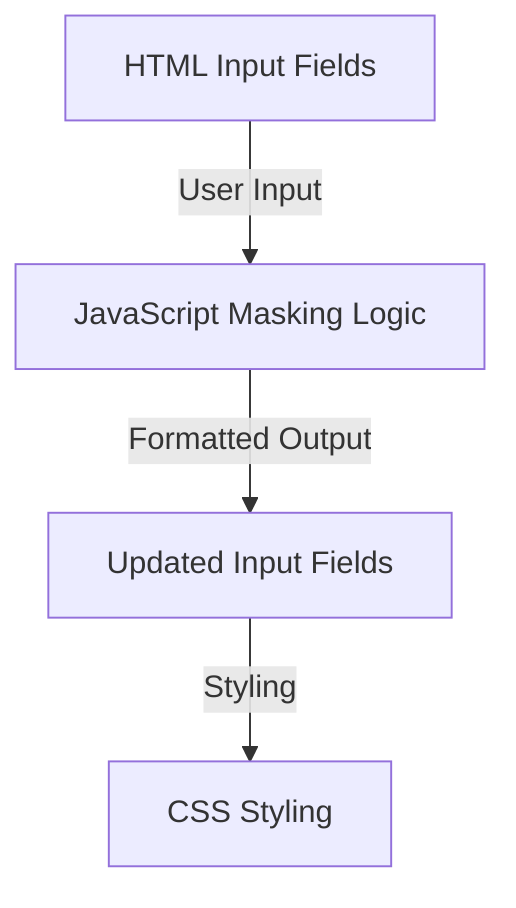

# Input Masked

---

[Input Masked 💳](https://axlgoze.github.io/Masked/)

A lightweight and aesthetic input masking solution for credit card forms. This project simplifies user input for credit card numbers, expiration dates, and CVV codes, ensuring a seamless and visually appealing user experience. It leverages JavaScript for dynamic masking and CSS for a vintage-inspired design.

**Tech Stack:**
- **Languages:** HTML, CSS, JavaScript
- **Tools/Frameworks:** None

---

## Visual Flow Map (Architecture)



---

## Core Components

| File/Class       | Primary Responsibility                     | Key Inputs/Outputs                     |
|------------------|-------------------------------------------|----------------------------------------|
| **index.html**   | Defines the structure of the input fields | Inputs: User data<br>Outputs: DOM     |
| **main.css**     | Provides vintage-inspired styling         | Inputs: None<br>Outputs: Styled UI    |
| **main.js**      | Implements input masking logic            | Inputs: Keypress events<br>Outputs: Masked input values |

---

## Installation & Usage

### Installation

```bash
# Clone the repository
$ git clone <repository-url>

# Navigate to the project directory
$ cd inputMasked
```

### Usage

1. Open `index.html` in your browser.
2. Interact with the input fields to see the masking in action.

---

#### Design:
- Separation of Concerns: HTML, CSS, and JavaScript are modularized.
- Accessibility: Ensures keyboard navigation and user-friendly interactions.
- Minimal Dependencies: No external libraries or frameworks.

#### Roadmap:
- [ ] Add support for additional input formats (e.g., phone numbers).
- [ ] Implement automated testing for input validation.
- [ ] Enhance accessibility for screen readers.
- [ ] Optimize performance for large-scale forms.
- [ ] Add dark mode support.

---

## Contribution & Testing

### How to Contribute
- Follow clean code principles.
- Ensure readability and maintainability.
- Submit pull requests with detailed descriptions.

### Testing
- Manual Testing: Interact with the input fields and verify masking functionality.
- Automated Testing: (Planned) Use testing frameworks to validate input handling.

---

### About me

[linkedin](https://www.linkedin.com/in/axel-reyes-wd/)

---